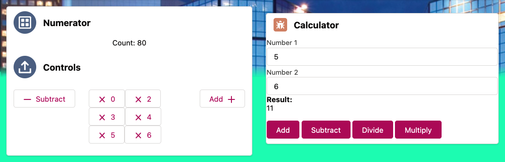

# Calculator LWCs
A simple calculator and a more advanced numerator component



### Simple Calculator
calculator.html
```html
<template>
    <div class="slds-m-around_small">
        <lightning-card title="Calculator" icon-name="custom:custom34">
            <lightning-input type="number" value={firstNumber} label="Number 1" name="number1" onchange={onNumberOneChange}></lightning-input>
            <lightning-input type="number" value={secondNumber} label="Number 2" name="number2" onchange={onNumberTwoChange}></lightning-input>
                <b>Result: </b><p>{resultValue}</p>
            <br/>
            <lightning-button variant="brand" label="Add" onclick={doSum}></lightning-button>
            &nbsp;
            <lightning-button variant="brand" label="Subtract" onclick={doSubt}></lightning-button>
            &nbsp;
            <lightning-button variant="brand" label="Divide" onclick={doDiv}></lightning-button>
            &nbsp;
            <lightning-button variant="brand" label="Multiply" onclick={doMulti}></lightning-button>
        </lightning-card>
    </div>
</template>
```
calculator.js
```js
import { LightningElement, track } from 'lwc';

export default class Calculator extends LightningElement {
    @track firstNumber;
    @track secondNumber;
    resultValue;

    onNumberOneChange (event) {
        this.firstNumber = parseInt(event.target.value);
    }
    onNumberTwoChange (event) {
        this.secondNumber = parseInt(event.target.value);
    }
    doSum() {
        this.resultValue = parseInt(this.firstNumber) + parseInt(this.secondNumber);
    }
    doSubt() {
        this.resultValue = this.firstNumber - this.secondNumber;
    }
    doDiv() {
        this.resultValue = this.firstNumber / this.secondNumber;
    }
    doMulti() {
        this.resultValue = this.firstNumber * this.secondNumber;
    }
}
```
### Advanced Numerator Calculator
numerator.html
```html
<template>
    <lightning-card title="Numerator" icon-name="action:manage_perm_sets">
        <p class="slds-text-align_center slds-var-m-around_medium">
            Count: <lightning-formatted-number value={counter}></lightning-formatted-number>
        </p>
        <c-controls class="slds-show slds-is-relative" onadd={handleIncrement} onsubtract={handleDecrement} onmultiply={handleMultiply} ondivide={handleDivide}></c-controls>
    </lightning-card>
</template>
```
numerator.js
```js
import { LightningElement } from 'lwc';

export default class Numerator extends LightningElement {
    counter = 0;
    handleIncrement() {
        this.counter++;
    }
    handleDecrement() {
        this.counter--;
    }
    handleMultiply(event) {
        const factor = event.detail;
        this.counter *= factor;
    }
    handleDivide(event) {
        const divide = event.detail;
        this.counter /= divide;
    }
}
```
controls.html
```html
<template>
    <lightning-card title="Controls" icon-name="action:upload">
        <lightning-layout>
            <lightning-layout-item flexibility="auto" padding="around-small">
                <lightning-button label="Subtract" icon-name="utility:dash" onclick={handleSubtract}></lightning-button>
            </lightning-layout-item>
            <lightning-layout-item flexibility="auto" padding="around-small" onbuttonclick={handleMultiply}>
                <template for:each={factors} for:item="factor">
                    <c-button key={factor} label={factor} data-factor={factor} icon="utility:close"></c-button>
                </template>
            </lightning-layout-item>
            <lightning-layout-item flexibility="auto" padding="around-small">
                <lightning-button label="Add" icon-name="utility:add" onclick={handleAdd} icon-position="right"></lightning-button>
            </lightning-layout-item>
        </lightning-layout>
    </lightning-card>
</template>
```
controls.js
```js
import { LightningElement } from 'lwc';

export default class Controls extends LightningElement {
    handleAdd() {
        this.dispatchEvent(new CustomEvent('add'));
    }
    handleSubtract() {
        this.dispatchEvent(new CustomEvent('subtract'));
    }
    handleMultiply(event) {
        const factor = event.target.dataset.factor;
        this.dispatchEvent(new CustomEvent('multiply', {
            detail: factor
        }))
    }
    factors = [0,2,3,4,5,6];
}
```
button.html
```html
<template>
    <lightning-button label={label} data-factor={label} icon-name={icon} onclick={handleButton}></lightning-button>
</template>
```
button.js
```js
import { LightningElement, api } from 'lwc';

export default class Button extends LightningElement {
    @api label;
    @api icon;
    handleButton(event) {
        this.dispatchEvent(new CustomEvent('buttonclick', {
            bubbles: true
        }))
    }
}
```
